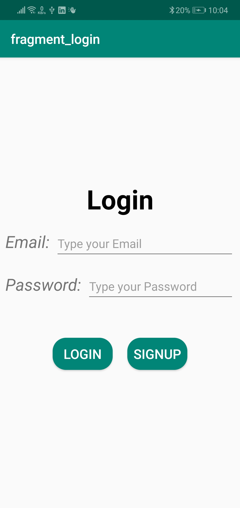
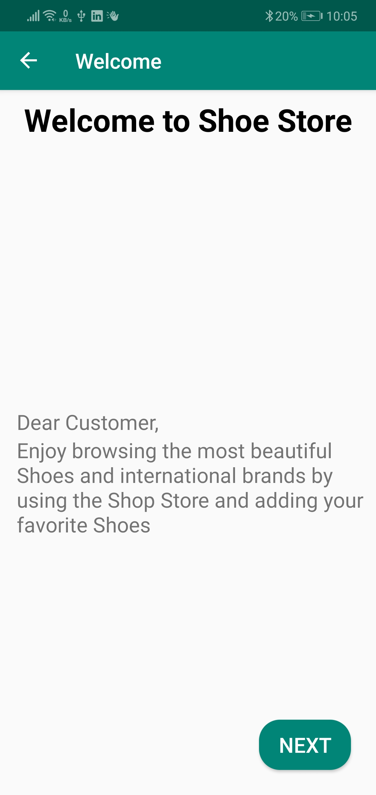
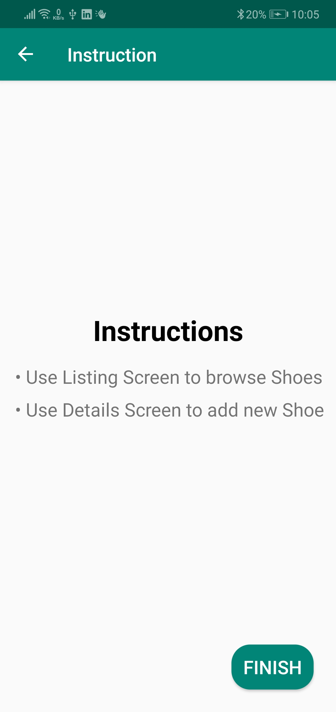
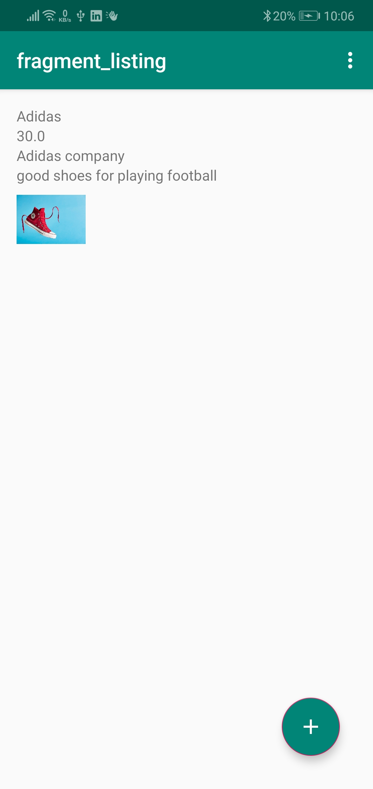
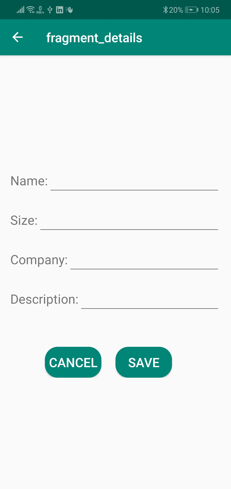

# The Shoe Store

project 1 for [Advanced Android Nanodegree egfwd, Udacity](https://egfwd.com/specializtion/android-kotlin/)

This project will consist of five screens. 

1. Login screen: Email and password fields and labels plus create and login buttons
2. Welcome onBoarding screen
3. Instructions onBoarding screen
4. Shoe Listing screen
5. Shoe Detail screen for adding a new shoe

### This Project use:
* Navigation Component
* LinearLayout and ConstraintLayout for design
* MVVM Pattern

### Screenshots

* Login Screen

* Welcome Screen 

* Instruction Screen

* Listing Screen

* Details Screen

![adding] (Screenshot/adding.jpg)
